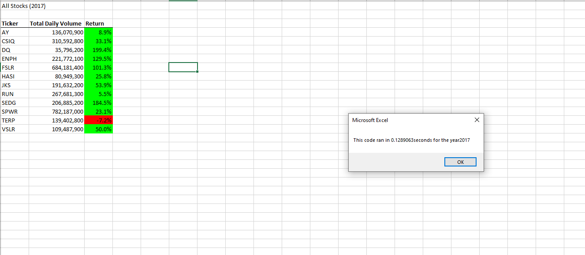
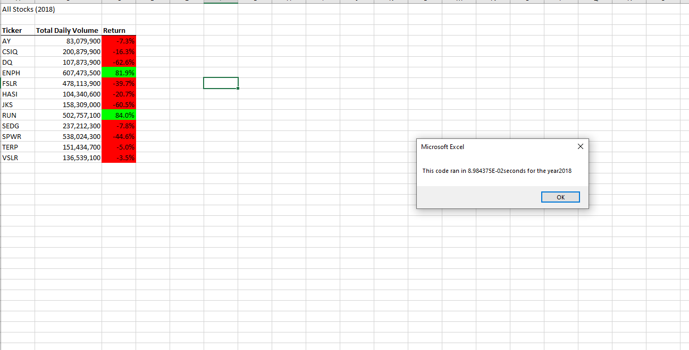

# Stocks Analysis

## Overview of Project
Analyze stocks performance for the years: 2017 and 2018. 
### Purpose
The purpose of the project is to provide the percentage gains or losses per ticker symbol based on the price difference between the first day and the last day.

## Results

### Analysis of 2017 Stock Data

2017 has been a very good year for stocks. Except TERP, all other stocks closed at much higher price compare to it's starting price. Price of DQ and SEDG went up over 180%. 

### Analysis of 2018 Stock Data

2018 has been a rough year for stocks. Except ENPH and RUN, all other stocks closed at much lower price compare to it's starting price. Price of DQ and JKS went down over 60%. 

The original script took about 0.8 to 0.9 seconds to execute. Refactored script outperformed original script. Refactored script took about 0.08 to 0.1 seconds to execute. It was almost 10 times faster.

## Summary

### Advantages of Refactctored Code
The advantgae of refactoring code is that it gives result by scanning stock data one time. That makes it extremely fast. 

### Disadvantages of Refactctored Code

The disadvantage of refactoring code is that it stores results in an array. It works fine when array size is small. It may run out of memory if the array size is too big for the computer to hold.

### Advantages in VBA Challenge
Since the array size is 11 elements, scanning stock data in one pass and storing it in an arrays is faster. 